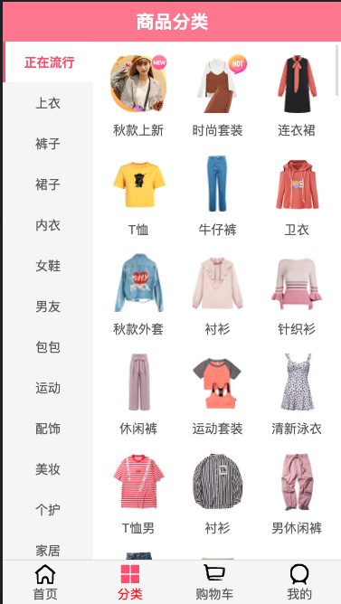
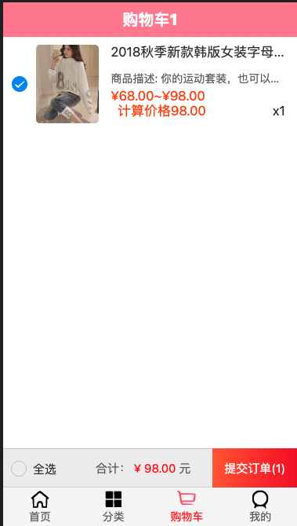
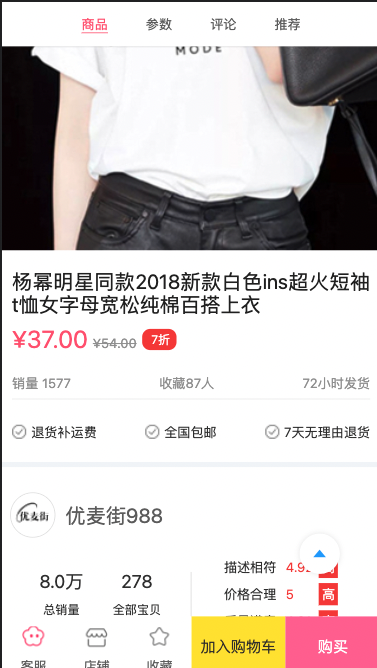
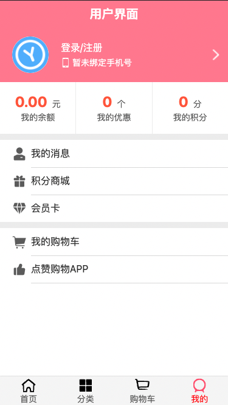

**项目地址**：[github 地址](https://github.com/SSDWGG/FangMogujie.git)  

# FangMogujie

### 前言

这是在最开始学习vue和前端一些技术的时候做的
该项目是跟着codewhy老师的项目学习的项目，codewhy老师提供了服务器，接口ip请向codewhy咨询

项目是一个购物商城的前端程序

该项目涉及到的知识点比较多
vue vue-cli vue-router vuex 
项目比较基础，对于新手一步一步的学习比较友好

仅做学习使用
 

### 1.项目截图

 

### 2.项目页面和功能

- [x] 首页展示商品页面（无限下拉分页请求功能，一键回到顶部功能）
- [x] 商品详情页（详情调转功能）
- [x] 商品添加到购物车功能
- [x] 商品分类展示页面
- [x]keeplive缓存状态功能

 